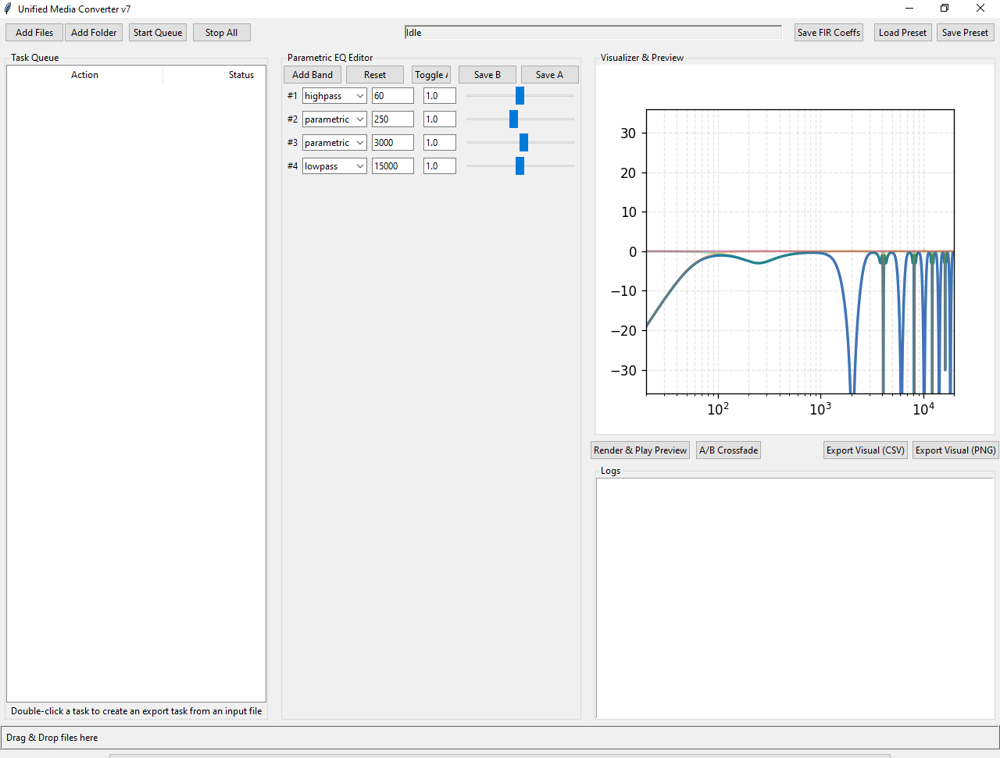

# Unified Media Converter

A professional, robust, single-file application for audio and video conversion with advanced parametric EQ capabilities.



## Features

### Audio & Video Conversion
- **Video → Audio Extraction**: Convert MP4, AVI, MKV, MOV files to MP3, AAC, FLAC, WAV, M4A with advanced libmp3lame options (CBR/VBR)
- **Video → Video Conversion**: Convert between MP4, AVI, MKV, MOV formats with quality/bitrate options
- **Audio → Audio Conversion**: Convert between MP3, AAC, FLAC, WAV, M4A, OGG formats with quality/bitrate options
- **Batch Processing**: Queue multiple files for sequential or parallel processing
- **Real-time Progress Tracking**: Visual progress bars and detailed logs for each conversion task

### Advanced Parametric EQ Editor
- **Multi-band EQ**: Parametric, highpass, and lowpass filter bands
- **Per-band Controls**: Mute, solo, and polarity inversion for each band
- **Visual Feedback**: Real-time frequency response visualization
- **Presets**: Save and load EQ configurations
- **A/B Comparison**: Switch between two EQ settings with instant preview

### Professional Audio Processing
- **FFmpeg Filter Chain**: Apply EQ using FFmpeg's native filter system
- **Linear-phase FIR Convolution**: Exact EQ processing using finite impulse response filters
- **FIR Coefficient Export**: Export coefficients as CSV, .f32 raw, or IR WAV files for use with FFmpeg's afir filter
- **Preview System**: Render and audition EQ settings before applying to full files
- **Crossfade Audition**: Seamless A/B comparison with crossfade transition

### User Interface
- **Intuitive Design**: Clean, modern interface with organized panels
- **Drag & Drop Support**: Easily add files by dragging them onto the application
- **Keyboard Shortcuts**: Efficient workflow with common shortcuts
- **Responsive Controls**: UI elements properly disabled during processing to prevent conflicts

## Requirements

### Essential
- **Python 3.8+**
- **ffmpeg and ffprobe** in system PATH

### Optional (Recommended)
```bash
pip install numpy matplotlib simpleaudio tkinterdnd2
```

## Installation

### 1. Install Python Dependencies
```bash
# Required
pip install tkinter

# Optional but recommended for full functionality
pip install numpy matplotlib simpleaudio tkinterdnd2
```

### 2. Install FFmpeg
#### Windows
Using Chocolatey:
```bash
choco install ffmpeg
```

Or download from [FFmpeg official site](https://ffmpeg.org/download.html)

#### macOS
Using Homebrew:
```bash
brew install ffmpeg
```

#### Linux (Ubuntu/Debian)
```bash
sudo apt update
sudo apt install ffmpeg
```

### 3. Download Application
Save the `unified_media_converter.py` file to your preferred location.

## Usage

### Starting the Application
```bash
python unified_media_converter.py
```

### Basic Workflow
1. **Add Files**: Click "Add Files" or "Add Folder" to load media files
2. **Configure EQ**: Adjust parametric EQ bands as needed
3. **Set Output Options**: Double-click a queued file to configure conversion settings
4. **Process Files**: Click "Start Queue" to begin conversion

### EQ Editor
- **Add Band**: Click "Add Band" to insert a new parametric EQ band
- **Adjust Parameters**: Use sliders and input fields to set frequency, bandwidth, and gain
- **Band Types**: Switch between parametric, highpass, and lowpass filters
- **Special Controls**:
  - Mute: Temporarily disable a band
  - Solo: Listen to only this band
  - Invert: Flip the phase/polarity of a band

### A/B Comparison
1. Configure EQ settings (A)
2. Click "Save A"
3. Modify EQ settings (B)
4. Click "Save B"
5. Use "Toggle A/B" to switch between configurations
6. Use "A/B Crossfade" for seamless comparison

### Export Options
When double-clicking a queued file, you can configure:
- **Output Format**: Select from supported audio/video formats
- **Quality Settings**: Sample rate, channels, and bitrate
- **EQ Processing**: Enable/disable EQ application
- **Processing Method**: Choose between FFmpeg filters or linear-phase FIR

## Technical Details

### Supported Formats

#### Video Input/Output
- MP4 (.mp4)
- AVI (.avi)
- MKV (.mkv)
- MOV (.mov)
- WMV (.wmv)
- FLV (.flv)
- WebM (.webm)

#### Audio Input/Output
- MP3 (.mp3)
- AAC (.aac)
- FLAC (.flac)
- WAV (.wav)
- M4A (.m4a)
- OGG (.ogg)
- WMA (.wma)

### DSP Capabilities

#### Parametric EQ Bands
Each band supports:
- **Frequency Range**: 1 Hz to Nyquist frequency
- **Bandwidth Control**: Q-factor or octave width
- **Gain Adjustment**: ±24dB boost/cut
- **Filter Types**: Peaking, highpass, lowpass

#### FIR Processing
- **Linear-phase Design**: Exact frequency response matching
- **Configurable Taps**: Adjustable filter length for quality/performance tradeoff
- **Overlap-add Convolution**: Efficient processing of large files

### Performance Optimization
- **Multithreading**: Separate worker threads for each conversion task
- **Memory Management**: Streaming processing for large files
- **Smart Caching**: Reuse computed EQ responses when possible

## Troubleshooting

### Common Issues

#### FFmpeg Not Found
**Problem**: Warning message about missing FFmpeg
**Solution**: Ensure FFmpeg is installed and in system PATH

#### No Audio Output
**Problem**: Converted files have no audio
**Solution**: 
1. Check that audio codecs are properly licensed
2. Verify source file isn't corrupted
3. Try different output format/bitrate combinations

#### Visualizer Not Working
**Problem**: EQ visualization not displayed
**Solution**: Install required packages:
```bash
pip install numpy matplotlib
```

#### Drag & Drop Not Working
**Problem**: Unable to drop files onto application
**Solution**: Install tkinterdnd2:
```bash
pip install tkinterdnd2
```

### Log Interpretation
The application provides detailed logging:
- **INFO**: General operation progress
- **CMD**: FFmpeg commands being executed
- **ERROR**: Processing failures with detailed messages
- **WARN**: Non-critical issues that may affect output quality

## Compilation to Executable

To compile the application into a standalone executable:

### Using PyInstaller
```bash
pip install pyinstaller
pyinstaller --onefile --windowed --icon=app_icon.ico unified_media_converter.py
```

### Using cx_Freeze
```bash
pip install cx_Freeze
cxfreeze unified_media_converter.py --target-dir dist
```

## Logo and Icon Design

### Logo Design Prompt
```
Create a modern, professional logo for "Unified Media Converter" featuring:
1. A stylized representation combining audio waveform and video playback elements
2. Color scheme: Professional blue (#2563EB) and gray tones with accent colors
3. Typography: Clean, modern sans-serif font
4. Symbolism: Unification of audio and video media processing
5. Style: Flat design, scalable for various sizes
6. Additional elements: Subtle technology/processing motifs
```

### Icon Sizes Required
For Windows application packaging, the following icon sizes are recommended:

| Size (pixels) | Purpose |
|---------------|---------|
| 16x16 | Toolbar icons, favicon |
| 24x24 | Small toolbar icons |
| 32x32 | Taskbar, file explorer |
| 48x48 | Medium application icons |
| 64x64 | Larger UI elements |
| 128x128 | High-DPI displays |
| 256x256 | Modern high-resolution displays |

### Inno Setup Script
For creating a Windows installer, use the following Inno Setup script template:

```ini
[Setup]
AppName=Unified Media Converter
AppVersion=1.0
DefaultDirName={pf}\UnifiedMediaConverter
DefaultGroupName=Unified Media Converter
Compression=lzma
SolidCompression=yes
OutputDir=.
OutputBaseFilename=unified_media_converter_setup
SetupIconFile=app_icon.ico

[Files]
Source: "dist\unified_media_converter.exe"; DestDir: "{app}"; Flags: ignoreversion
Source: "README.md"; DestDir: "{app}"; Flags: ignoreversion

[Icons]
Name: "{group}\Unified Media Converter"; Filename: "{app}\unified_media_converter.exe"; IconFilename: "{app}\unified_media_converter.exe"
Name: "{group}\Uninstall Unified Media Converter"; Filename: "{uninstallexe}"
Name: "{autodesktop}\Unified Media Converter"; Filename: "{app}\unified_media_converter.exe"; IconFilename: "{app}\unified_media_converter.exe"

[Run]
Filename: "{app}\unified_media_converter.exe"; Description: "{cm:LaunchProgram,Unified Media Converter}"; Flags: nowait postinstall skipifsilent
```

## Contributing

Contributions are welcome! Please follow these guidelines:

1. Fork the repository
2. Create a feature branch
3. Commit your changes
4. Push to the branch
5. Create a pull request

## License

This project is licensed under the MIT License - see the LICENSE file for details.

## Acknowledgments

- FFmpeg project for powerful multimedia processing capabilities
- NumPy and Matplotlib for scientific computing and visualization
- Tkinter for GUI framework
- Simpleaudio for cross-platform audio playback
- TkinterDnD for drag-and-drop functionality

## Changelog

### Version 1.0
- Added comprehensive video-to-video conversion capabilities
- Enhanced audio-to-audio conversion with more format support
- Improved parametric EQ editor with visualization
- Added FIR coefficient export functionality
- Implemented batch processing queue with progress tracking
- Added A/B comparison and crossfade audition
- Improved UI with drag-and-drop support
- Added preset management system

### Version 0.1
- Initial release with basic audio conversion and EQ capabilities

---

*For support, feature requests, or bug reports, please open an issue on the project repository.*


